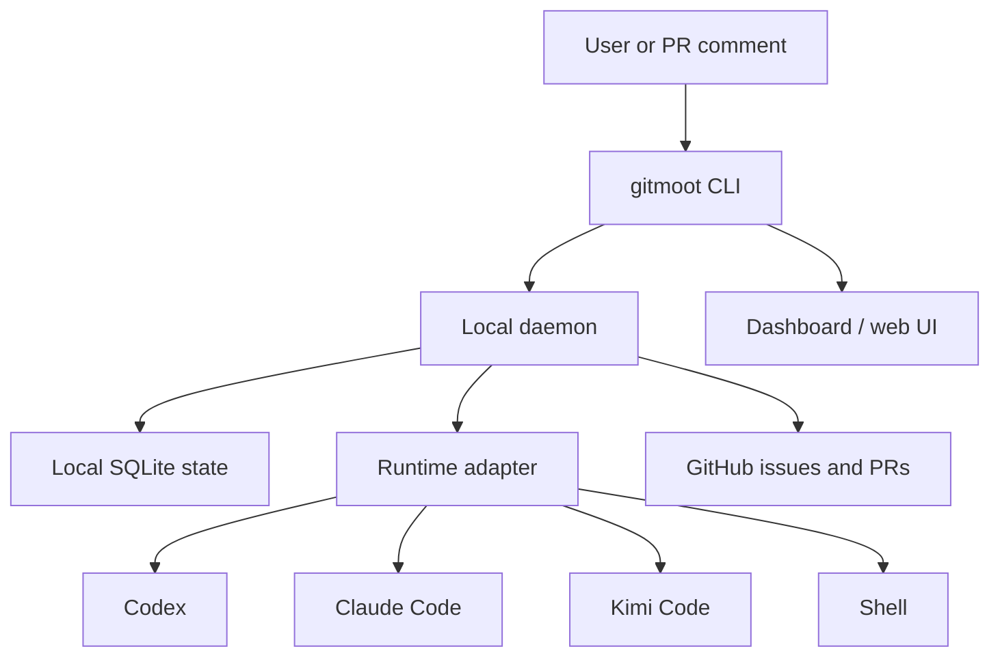
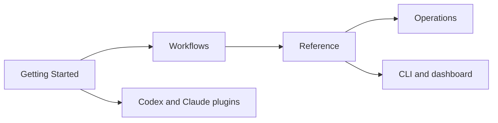

# Gitmoot

Gitmoot coordinates local AI agents through the same surface teams already use
to audit software work: repositories and pull requests.

It runs on the user's machine, stores workflow state in local SQLite, polls
GitHub pull request comments, routes jobs to registered agent runtimes, and
writes attributed results back to the pull request discussion. There is no
hosted control plane in the current beta.

:::tip For agents
New here? Open **[`llms.txt`](https://gitmoot.io/llms.txt)** — the
machine-readable index of these docs — and the agent skill
**[`SKILL.md`](https://gitmoot.io/SKILL.md)**.
**[`llms-full.txt`](https://gitmoot.io/llms-full.txt)** has the full expanded
context in one file.
:::

## What Gitmoot Is For

- Route PR comments to named local agents.
- Keep Codex, Claude Code, Kimi Code, shell, and future runtimes behind one
  agent model.
- Start or subscribe agents with explicit repo access and capabilities.
- Orchestrate work across multiple agents with structured delegations and
  automatic synthesis.
- Use agent templates for reusable planner, review, or custom prompt agents.
- Capture a successful current chat as a reviewed, reusable agent template
  draft.
- Import a cached agent prompt into the current chat with
  `gitmoot agent prompt <agent-or-template>`.
- Track jobs, branch locks, goals, tasks, reviews, and merges locally.
- Run `gitmoot dashboard` for a styled snapshot of daemon health, repos, agents,
  jobs by state, worktrees, and branch locks — or `gitmoot dashboard --web` for
  a read-only browser view of a running orchestration.

## How It Works

Codex, Claude Code, Kimi Code, and omp are the runtimes Gitmoot can start or
subscribe; shell is subscribe-only.

Use the docs here for the human workflow; agents have the index callout above.

## Docs Map

